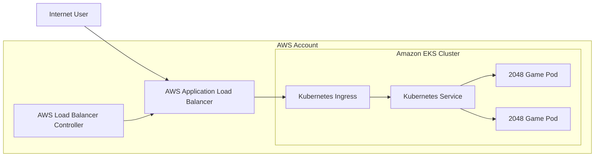

# AWS EKS 2048 Game Deployment Project

**Author:** Siva Satya Prasad Reddy  
**Role Focus:** Cloud DevOps / SRE / Kubernetes Operations  
**Project Type:** Practical AWS EKS portfolio project

## 1. Project Overview

This project demonstrates how to deploy a containerized web application, the **2048 game**, on **Amazon Elastic Kubernetes Service (Amazon EKS)** and expose it publicly using the **AWS Load Balancer Controller** and Kubernetes **Ingress**.

The purpose of this repository is to show practical hands-on skills in:

- Provisioning an Amazon EKS cluster
- Using AWS Fargate profiles for serverless Kubernetes workloads
- Deploying Kubernetes workloads using YAML manifests
- Exposing applications using Kubernetes Service and Ingress
- Integrating EKS with AWS Application Load Balancer
- Validating and troubleshooting Kubernetes resources
- Cleaning up AWS resources safely to avoid unnecessary cost

## 2. Architecture



## 3. Services and Tools Used

| Category | Tool / Service |
|---|---|
| Cloud Provider | AWS |
| Kubernetes Platform | Amazon EKS |
| Compute Mode | AWS Fargate |
| Container Orchestration | Kubernetes |
| External Access | AWS Application Load Balancer |
| Ingress Integration | AWS Load Balancer Controller |
| CLI Tools | awscli, kubectl, eksctl, helm |
| Application | 2048 game container image |

## 4. Repository Structure

```text
.
├── README.md
├── manifests/
│   ├── namespace.yaml
│   ├── deployment.yaml
│   ├── service.yaml
│   ├── ingress.yaml
│   └── kustomization.yaml
├── scripts/
│   ├── 00-prereqs-check.sh
│   ├── 01-create-cluster.sh
│   ├── 02-create-fargate-profile.sh
│   ├── 03-install-aws-load-balancer-controller.sh
│   ├── 04-deploy-application.sh
│   ├── 05-validate.sh
│   └── 99-cleanup.sh
├── docs/
│   ├── implementation-runbook.md
│   ├── troubleshooting.md
│   └── interview-notes.md
├── screenshots/
│   └── .gitkeep
└── .github/workflows/
    └── validate-yaml.yml
```

## 5. Prerequisites

Before starting, configure the following tools locally or in AWS CloudShell:

```bash
aws --version
kubectl version --client
eksctl version
helm version
```

Also ensure that your AWS identity has permission to create EKS, IAM, VPC, Fargate, CloudFormation, and Elastic Load Balancing resources.

## 6. Quick Start

> Update the variables in each script before execution, especially `AWS_REGION`, `CLUSTER_NAME`, and `AWS_ACCOUNT_ID`.

```bash
chmod +x scripts/*.sh

./scripts/00-prereqs-check.sh
./scripts/01-create-cluster.sh
./scripts/02-create-fargate-profile.sh
./scripts/03-install-aws-load-balancer-controller.sh
./scripts/04-deploy-application.sh
./scripts/05-validate.sh
```

After the Ingress is created, get the ALB DNS name:

```bash
kubectl get ingress -n game-2048
```

Open the `ADDRESS` value in a browser.

## 7. Manual Kubernetes Deployment

```bash
kubectl apply -k manifests/
kubectl get all -n game-2048
kubectl get ingress -n game-2048
```

## 8. Validation Commands

```bash
kubectl get nodes
kubectl get ns
kubectl get pods -n game-2048 -o wide
kubectl get svc -n game-2048
kubectl describe ingress ingress-2048 -n game-2048
kubectl logs -n kube-system deployment/aws-load-balancer-controller
```

## 9. Cleanup

AWS EKS and ALB resources can generate cost. Remove resources after the lab:

```bash
./scripts/99-cleanup.sh
```

## 10. Project Outcome

At the end of this project, I successfully demonstrated:

- Creation of an EKS cluster
- Serverless workload scheduling using Fargate profile
- Deployment of a containerized application on Kubernetes
- Service-based internal exposure
- Ingress-based external exposure using AWS ALB
- Operational validation and cleanup

## 11. Notes

This repository is written as a personal portfolio implementation inspired by public learning material. The commands and structure were rewritten and organized into a practical DevOps/SRE-style GitHub project.

## 12. References

- Amazon EKS official documentation
- AWS Load Balancer Controller official documentation
- Kubernetes official documentation
